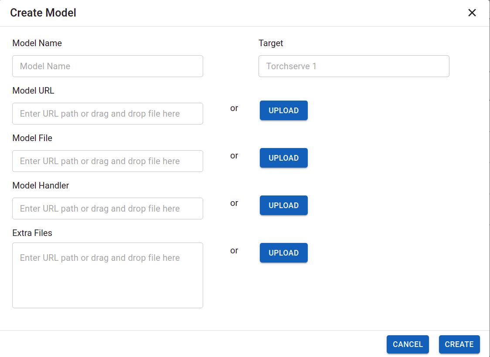
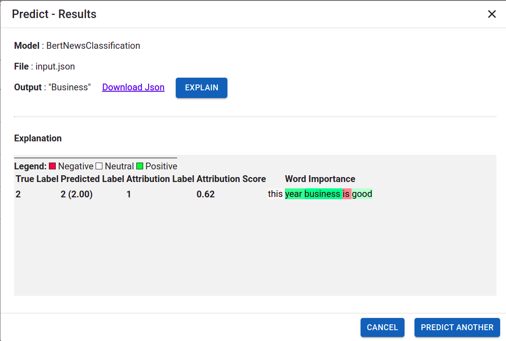

# Mlflow-TorchServe

A plugin that integrates [TorchServe](https://github.com/pytorch/serve) with MLflow pipeline.
``mlflow_torchserve`` enables mlflow users to deploy the  mlflow pipeline models into TorchServe .
Command line APIs of the plugin (also accessible through mlflow's python package) makes the deployment process seamless.

## Prerequisites

Following are the list of packages which needs to be installed before running the TorchServe deployment plugin

1. torch-model-archiver
2. torchserve
3. mlflow


## Installation
Plugin package which is available in pypi and can be installed using

```bash
pip install mlflow-torchserve
```
##Installation from Source

Plugin package could also be installed from source using the following commands
```
python setup.py build
python setup.py install
```

###MLFlow Torchserve UI 
To use MLFlow torchserve UI do the following steps
* Start API server<br/>
```
cd app
python app.py
```
* Start UI
```
cd frontend
npm install
npm start
```

## What does it do
Installing this package uses python's entrypoint mechanism to register the plugin into MLflow's
plugin registry. This registry will be invoked each time you launch MLflow script or command line
argument.


### Create deployment
The `create` command line argument and ``create_deployment`` python
APIs does the deployment of a model built with MLflow to TorchServe.

##### CLI
```shell script
mlflow deployments create -t torchserve -m <model uri> --name DEPLOYMENT_NAME -C 'MODEL_FILE=<model file path>' -C 'HANDLER=<handler file path>'
```

##### Python API
```python
from mlflow.deployments import get_deploy_client
target_uri = 'torchserve'
plugin = get_deploy_client(target_uri)
plugin.create_deployment(name=<deployment name>, model_uri=<model uri>, config={"MODEL_FILE": <model file path>, "HANDLER": <handler file path>})
```

##### UI


### Update deployment
Update API can used to modify the configuration parameters such as number of workers, version etc., of an already deployed model.
TorchServe will make sure the user experience is seamless while changing the model in a live environment.

##### CLI
```shell script
mlflow deployments update -t torchserve --name <deployment name> -C "min-worker=<number of workers>"
```

##### Python API
```python
plugin.update_deployment(name=<deployment name>, config={'min-worker': <number of workers>})
```

##### UI


### Delete deployment
Delete an existing deployment. Excepton will be raised if the model is not already deployed.

##### CLI
```shell script
mlflow deployments delete -t torchserve --name <deployment name / version number>
```

##### Python API
```python
plugin.delete_deployment(name=<deployment name / version number>)
```

### List all deployments
Lists the names of all the models deployed on the configured TorchServe.

##### CLI
```shell script
mlflow deployments list -t torchserve
```

##### Python API
```python
plugin.list_deployments()
```

##### UI


### Get deployment details
Get API fetches the details of the deployed model. By default, Get API fetches all the versions of the 
deployed model.

##### CLI
```shell script
mlflow deployments get -t torchserve --name <deployment name>
```

##### Python API
```python
plugin.get_deployment(name=<deployment name>)
```

##### UI


### Run Prediction on deployed model
Predict API enables to run prediction on the deployed model.

For the prediction inputs, DataFrame, Tensor and Json formats are supported. The python API supports all of these
 three formats. When invoked via command line, one needs to pass the json file path that contains the inputs.

##### CLI
```shell script
mlflow deployments predict -t torchserve --name <deployment name> --input-path <input file path> --output-path <output file path>
```

output-path is an optional parameter. Without output path parameter result will be printed in console.

##### Python API
```python
plugin.predict(name=<deployment name>, df=<prediction input>)
```

##### UI


### Run Explain on deployed model
Explain API enables to get explanation on the deployed model.

##### CLI
```shell script
mlflow deployments explain -t torchserve --name <deployment name> --input-path <input file path> --output-path <output file path>
```

output-path is an optional parameter. Without output path parameter result will be printed in console.

##### UI


### Plugin help
Run the following command to get the plugin help string.

##### CLI
```shell script
mlflow deployments help -t torchserve
```


